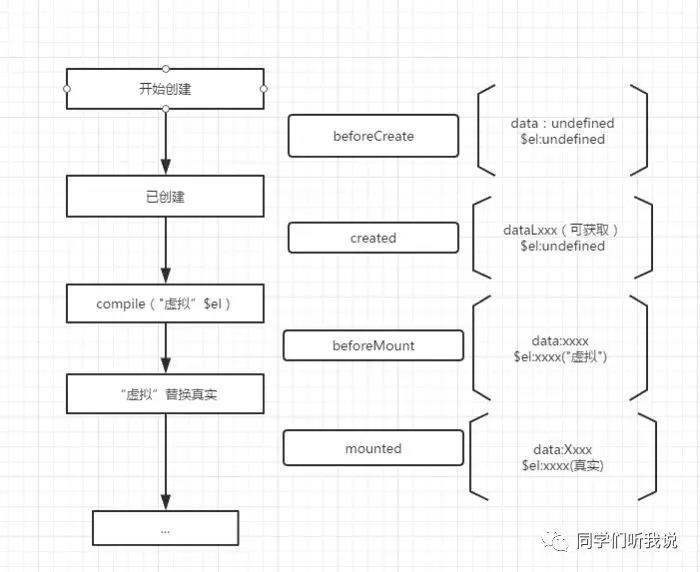

# 生命周期  

生命周期函数就是 Vue 实例在某一个时间点会自动执行的函数  




## beforeCreate( 创建前 )  

在实例初始化之后，数据观测和事件配置之前被调用，此时el 和 data 并未初始化，因此无法访问methods， data， computed等上的方法和数据。  

```javascript 
beforeCreate() {
console.log('创建前-挂在', this.$el)    // undefined
console.log('创建前-data', this.$data)  // undefined
}
```

## created ( 创建后 )  

实例已经创建完成之后被调用,完成了data 数据的初始化，不能访问到$el，$ref属性内容未空数组。挂载阶段还没有开始,可以调用methods中的方法，改变data中的数据，并且修改可以通过vue的响应式绑定体现在页面上,获取computed中的计算属性等等。

```javascript
created() {
console.log('创建时--el', this.$el) // undefined
console.log('创建时--data', this.message)   // xxx
console.log('创建时-computed', this.a)  // xxx
console.log('创建时--methods', this.onClick())  // xxx
}
```


## beforeMount  

挂在开始之前被调用,实例已完成以下的配置： 编译模板，生成html，完成了 el 和data 初始化，注意此时还没有挂在html到页面上, 此时页面中的{{}}还没有被替换掉。  

```javascript
beforeMount() {
    console.log($el)    // <div id="app"></div>
}
```

## mounted  

挂在完成，也就是模板中的HTML渲染到HTML页面中，此时一般可以做一些ajax操作，mounted只会执行一次。

```javascript
beforeMount() {
    console.log($el)    // <div id="app">hello world</div>
}
```

## beforeUpdate  

mounted 之后 数据发生改变之前。  


## updated（更新后)  

mounted 之后 数据发生改变后。
