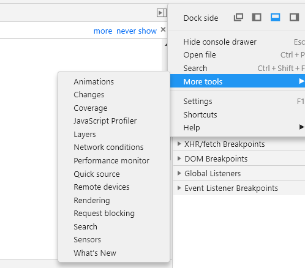

# preloading prefetching  

使用命令行配置webpack --profile --json > stats.json，把打包过程的描述生成到stats.json中。  

```javascript
// packages
"dev-build": "webpack --profile --json > stats.json --config webpack.config.js"
```  

进入到 http://webpack.github.com/analyse，上传刚刚生成的json文件。  


谷歌浏览器调试工具 coverage  

  

通过工具可以看出异步引入 js 的方式可以提高 js 的使用率，这也是 webpack 配置项中 optimization.aplitChunks.chunks 默认值为 async 的原因。  

通过 webpack 魔法注释可以实现异步加载 js。  

```javascript
document.addEventListener('click', () => {
    import (/* webpackPrefetch: true */'./click.js').then(({ default: func }) => {
        func()
    })
})
```


